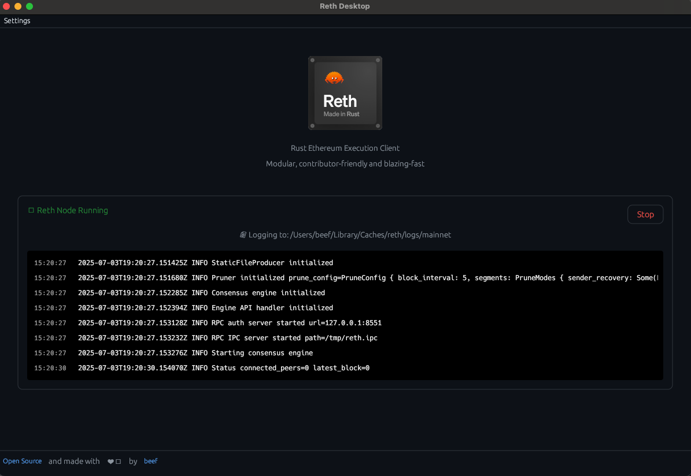

# Reth Desktop

A fast + lightweight desktop GUI application for managing [Reth](https://github.com/paradigmxyz/reth) Ethereum node installations and operations.



## Value Proposition

- **Simplified Node Management**: Install, configure, and monitor Reth nodes without command-line complexity
- **Real-time Monitoring**: Live log streaming and process status tracking
- **Configuration Management**: Visual interface for editing Reth's TOML configuration
- **Cross-platform Support**: Native desktop app for macOS, Linux, and Windows
- **Process Detection**: Automatically detects and connects to existing Reth instances

## Key Features

- **Automated Installation**: Downloads and installs Reth binaries from GitHub releases
- **Live Terminal**: Real-time log streaming with color-coded log levels
- **External Process Support**: Connects to Reth instances started outside the GUI
- **Settings Management**: Visual editors for node configuration and desktop preferences
- **System Requirements**: Automatic validation of system capabilities

## Architecture

### Technology Stack
- **Frontend**: Rust + egui/eframe for native cross-platform GUI
- **Backend**: Tokio async runtime for process management and file I/O
- **Configuration**: TOML parsing with serde for Reth config management

### Key Design Decisions

1. **Native Performance**: Built with Rust and egui for minimal resource usage and fast startup
2. **Async Architecture**: Tokio runtime enables non-blocking UI while managing system processes
3. **Modular Design**: Separate modules for installation, configuration, UI components, and node management
4. **Platform Abstraction**: Uses `dirs` crate for cross-platform file system paths
5. **Process Detection**: Port-based detection (8545, 8546, 8551) rather than process name matching for reliability
6. **Log File Integration**: Automatic discovery and tailing of Reth log files across different network configurations

### File Structure
```
src/
├── main.rs              # Application entry point and main UI loop
├── installer.rs         # Reth binary installation and updates
├── reth_node.rs         # Process management and log streaming
├── config.rs            # TOML configuration parsing and management
├── ui/
│   ├── node_settings.rs # Configuration UI components
│   └── desktop_settings.rs # Application preferences
├── system_check.rs      # System requirements validation
└── theme.rs             # UI styling and colors
```

## Getting Started

1. **Build**: `cargo build --release`
2. **Run**: `cargo run` or execute the binary
3. **Install Reth**: Use the GUI to download and install Reth
4. **Configure**: Edit node settings through the visual interface
5. **Monitor**: Start your node and watch real-time logs

## Configuration

The app manages Reth's configuration files automatically:
- **Config Location**: `~/.local/share/reth/mainnet/reth.toml` (Linux) or platform equivalent
- **Log Files**: `~/.cache/reth/logs/mainnet/reth.log` (auto-detected)
- **Settings**: Application preferences stored in platform-specific directories

## Requirements

- Rust 1.70+ for building
- 4GB+ RAM for running Reth
- 2TB+ disk space for full node sync
- Stable internet connection
